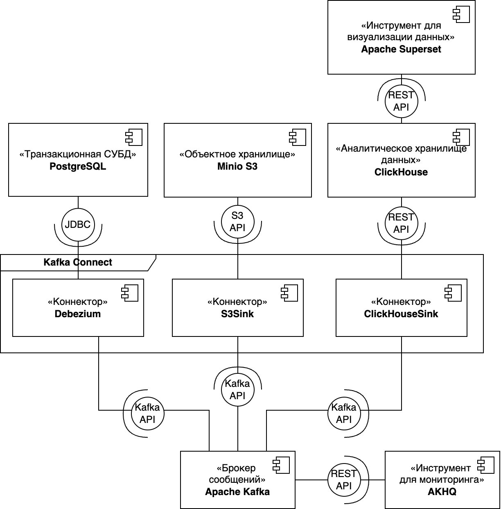

# Data Platform Deployer (dpd) 🚀

**Data Platform Deployer (`dpd`)** is a CLI tool for automatically generating configurations and deploying a data platform based on a declarative description.

## 🔥 Features
- 📜 **Configuration generation** for Kafka, ClickHouse, PostgreSQL, S3, and more.
- 🚀 **Automated deployment** of the data platform.
- 🛠 **Flexible configuration** via JSON.
- 🏗 **Supports Docker Compose** and (future) Kubernetes.


## 🌐 Web UI (REPL)
Try dpd in your browser without installation:  
👉 [**DPD Playground (Streamlit UI)**](https://trydpd.streamlit.app)


## 🏗 Architecture
Here's the high-level component diagram of what dpd can deploy:




## 🚀 Installation
Install from **PyPI**:
```sh
pip install data-platfrom-deployer
```
## 📝 Usage
Once installed, you can run dpd from the command line:
```sh 
dpd --help
```
Generate configuration files
```sh 
dpd generate --config config.yaml
```

Example config:
```yaml
project:
  name: data-platform
  version: 1.0.0
  description: This is a test project
sources:
  - type: postgres
    name: postgres_1
  - type: postgres
    name: postgres_2
  - type: s3
    name: s3_1
streaming:
  kafka:
    num_brokers: 3
  connect:
    name: connect-1
storage:
  clickhouse:
    name: clickhouse-1 
bi:
  superset:
    name: superset-1 


```

